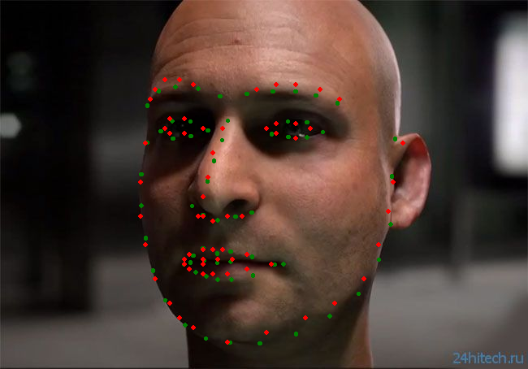

# loreal-poc

Assessing the quality of facial landmark models

## Setup

prod-env

```shell
pdm install --prod
source .venv/bin/activate
```

dev-env

```shell
pdm install
source .venv/bin/activate
```

## Examples

setup dev-env and run the `examples/example1.ipynb` notebook.
On 5 samples from 300W:

```python
TestResult(name='Mean Euclidean Distance (ME)', metric=12.496953183186655, passed=False)
TestResult(name='Normalized Mean Euclidean Distance (NME)', metric=0.06321234461079239, passed=False)
```

sample #1 example (green: ground-truth, red: predictions from face-alignment model):


## Benchmark Datasets

From https://paperswithcode.com/task/facial-landmark-detection

- [x] 300W

## Metrics

- [x] ME (Mean euclidean distances)
- [x] NME (Normalised euclidean distances)
